# SHERPA — Security Harness Engineering for Robust Program Analysis

<div align="center">


**Revolutionary LLM-powered fuzzing that targets attacker-controlled entry points**  
*Finding real bugs by moving fuzzing up the stack to where attackers actually hit production systems*

<sub><em>Developed as part of DARPA's <strong><a href="https://aicyberchallenge.com">AI Cyber Challenge (AIxCC)</a></strong></em></sub>

</div>

---

## 🎯 Impact: Real Bugs in Production Software

<div align="center">

| 💥 **Raw Crashes Found** | 🔍 **Auto-Filtered** | ✅ **Validated CVE-Class Bugs** | 🎯 **Precision Rate** |
|:---:|:---:|:---:|:---:|
| **127+** | **100+** | **18** | **67%** |

</div>

**What makes this significant:**
* 🎯 **Targeted Discovery**: 18 validated bugs from just 27 high-signal crashes (vs. typical fuzzing's 1-5% success rate)
* 🚀 **Speed**: Minutes of targeted fuzzing vs. weeks of traditional coverage-guided fuzzing
* 🔍 **Quality**: LLM crash analysis automatically filters 80% of false positives before human review
* 📦 **Production Ready**: Every bug comes with reproducer, analysis, and patch guidance
* 🔒 **Responsible Process**: Bugs are disclosed responsibly to maintainers with coordinated timelines

<table>
<tr>
<td width="60%">

**The Problem:** Traditional fuzzing targets low-level APIs that attackers rarely reach directly. Real exploits happen at high-level parsers processing attacker-controlled files, packets, and streams.

**SHERPA's Solution:** An LLM pipeline that automatically identifies and generates fuzz harnesses for these high-value, attacker-controlled entry points in OSS-Fuzz projects—the exact functions that parse malicious PDFs, process network packets, and handle file uploads.

**🚀 Key Innovation:** Moving fuzzing *up the stack* to where real attacks happen, with LLM agents that understand security impact and generate maintainer-ready artifacts.

</td>
<td width="40%" align="center">

<picture>
  <source media="(prefers-color-scheme: dark)" srcset="assets/logo_white.png">
  <source media="(prefers-color-scheme: light)" srcset="assets/logo_black.png">
  
</picture>

</td>
</tr>
</table>

* 🧪 **27 crash‑inducing inputs auto‑produced** across multiple OSS‑Fuzz projects
* ✅ **18 validated bugs** after human triage (**\~67%** of auto‑produced crashes)
* 🧹 **100+ false positives crashes auto‑filtered** by our LLM crash‑analysis agent
* 🧵 **New high‑value harnesses**: focus on top‑level parsers and public APIs that consume untrusted data

## 🚀 Quick Start

```bash
# Clone the repository
git clone https://github.com/AIxCyberChallenge/sherpa.git

# Run environment setup (Supports macOS & Linux)
make setup

# Generate harnesses for a target project (leveldb)
# On Apple Silicon (M1/M2/M4), ensure Docker uses amd64 architecture:
export DOCKER_DEFAULT_PLATFORM=linux/amd64
# Set your OpenAI API key (required for harness generation)
export OPENAI_API_KEY="your-api-key-here"
# Run an example repo against the existing harness_generator_yamls/leveldb.yaml file
make leveldb
```

## 🏗️ How It Works

```mermaid
flowchart TD
    A[📦 OSS-Fuzz Project] --> B{🔍 Coverage Analysis}
    B --> C[🎯 Identify Unfuzzed Entry Points]
    
    C --> D[🤖 LLM Harness Generation]
    D --> E[🔨 Build & Test Harness]
    E --> F{✅ Build Success?}
    F -->|No| G[🛠️ Auto-Fix Build Issues]
    G --> E
    
    F -->|Yes| H[🎲 Fuzzing Campaign]
    H --> I[💥 Crash Detection]
    I --> J[🧠 LLM Crash Analysis]
    J --> K{🔬 Valid Bug?}
    
    K -->|No| L[❌ Filter False Positive]
    K -->|Yes| M[📋 Generate Bug Report]
    
    M --> N[✅ Validated Bug + Artifacts]
    L --> O[📊 Metrics Update]
    N --> O
    
    %% Position nodes to use horizontal space better
    B ~~~ D
    E ~~~ H
    J ~~~ M
    L ~~~ N
    
    style A fill:#e1f5fe
    style D fill:#f3e5f5
    style J fill:#f3e5f5
    style N fill:#e8f5e8
    style L fill:#ffebee
    
    classDef aiNode fill:#f3e5f5,stroke:#9c27b0,stroke-width:2px
    classDef successNode fill:#e8f5e8,stroke:#4caf50,stroke-width:2px
    classDef errorNode fill:#ffebee,stroke:#f44336,stroke-width:2px
    
    class D,J aiNode
    class N successNode
    class L errorNode
```



**Pipeline Stages:**

1. **📊 Coverage Gap Analysis**: Identify unfuzzed, attacker-controlled entry points
2. **🤖 LLM Harness Generation**: Generate targeted fuzz harnesses using LLM agents  
3. **🔨 Build-Until-Green**: Automatically fix compilation and build issues
4. **🎯 Targeted Fuzzing**: Run focused fuzzing campaigns on new harnesses
5. **🧠 LLM Crash Triage**: Automatically filter false positives and analyze crashes
6. **📋 Maintainer Artifacts**: Deliver actionable bug reports with repro steps

---

Through these techniques we were able to produce **new harnesses** as well as **corresponding crashing fuzzer inputs**. Each auto‑produced crash is summarized below.

# Automatically Produced Crashes

| Bug Type                             | CWE     | Repo Count |
|--------------------------------------|---------|------------|
| Uncontrolled memory allocation (DoS) | CWE-770 | 12         |
| Heap buffer overflow                 | CWE-122 | 4          |
| Off-by-one heap buffer overflow      | CWE-193 | 3          |
| Null pointer dereference             | CWE-476 | 2          |
| Out-of-bounds string replacement     | CWE-787 | 1          |
| Performance hang                     | CWE-834 | 1          |
| Infinite loop (DoS)                  | CWE-835 | 1          |
| Double-free                          | CWE-415 | 1          |
| Uninitialized memory read            | CWE-908 | 1          |
| Stack buffer underflow               | CWE-124 | 1          |

From these crashes, human engineers performed triage and validation to produce a set of **legitimate bugs**. The validated set is shown below.

# Validated Bugs

| Bug Type                             | CWE     | Repo Count |
|--------------------------------------|---------|------------|
| Uncontrolled memory allocation (DoS) | CWE-770 | 8          |
| Off-by-one heap buffer overflow      | CWE-193 | 3          |
| Heap buffer overflow                 | CWE-122 | 2          |
| Infinite loop (DoS)                  | CWE-835 | 1          |
| Null pointer dereference             | CWE-476 | 1          |
| Stack buffer underflow               | CWE-124 | 1          |
| Double-free                          | CWE-415 | 1          |
| Uninitialized memory read            | CWE-908 | 1          |

---
<!-- Embedded chart (SVG with PNG fallback). Left-aligned -->
<p>
  <picture>
    <source type="image/svg+xml" srcset="assets/validated_bugs.png">
    
  </picture>
  <br><sub>Figure: Validated bugs by category (n=18).</sub>
</p>

> 
---
**📋 Responsible Disclosure Note**

We provide a detailed [LevelDB case study](leveldb_writeup/workflow.md) as a complete example of SHERPA's methodology. The remaining 17 validated bugs are currently undergoing responsible disclosure with their respective maintainers. Full technical details and attribution to SHERPA will be published upon completion of the disclosure process, ensuring maintainers have adequate time to develop and deploy patches.

---

## False Positives & Quality Control

We encountered **>100 raw false positives** (e.g., harness errors, misuse of library APIs, or practically unreachable conditions). These were **automatically triaged** by an LLM crash‑analysis agent and **excluded** from the *Automatically Produced Crashes* table. The remaining items were then **manually triaged** to produce the *Validated Bugs* table above.

**How we mitigate false positives (two layers):**

1. **Ex‑ante safeguards in the harness‑generator prompt**
   The generator is instructed to:

   * Target **public/documented APIs** and **high‑level parsers** that ingest attacker‑controlled inputs.
   * **Mirror canonical initialization** and teardown patterns from project examples.
   * **Honor documented preconditions** (sizes, flags, state); avoid undefined behavior and unrealistic call sequences.
   * Prefer **file/stream entry points** and add a small, meaningful seed corpus.
   * Compile with sanitizers and ensure resource hygiene (close files, free objects).

2. **Ex‑post LLM crash analysis (automatic triage)**
   For each crash, the agent:

   * Parses sanitizer logs and **attributes the fault** to project/library vs. harness code.
   * Detects **harness anti‑patterns** (calling private/internal functions, skipping required init, invalid lifetimes, wrong buffer sizes/flags).
   * Labels likely non‑bugs as false-positives and filters them out.
   * Produces `crash_analysis.md` with root cause, impact, and patch guidance for retained findings.

This two‑stage process yields a **high‑signal set** of auto‑produced crashes (first table), which then undergo **human validation** (second table) to confirm exploitability and practical relevance.

---

## 🚀 Why This Changes Everything

**Traditional fuzzing finds bugs that attackers can't reach. SHERPA finds bugs that attackers exploit.**

### **The Fundamental Problem**
Current fuzzing tools excel at hitting internal parsing functions, but attackers don't call `parse_header_field()` directly. They upload malicious PDFs, send crafted network packets, or submit malformed form data. There's a massive gap between what we fuzz and what attackers actually hit.

### **SHERPA's Paradigm Shift**

| Traditional Approach | SHERPA Approach |
|---------------------|---------------|
| 🎯 **Target**: Low-level internal APIs | 🎯 **Target**: Attacker-controlled entry points |
| ⏱️ **Speed**: Weeks of coverage-guided fuzzing | ⏱️ **Speed**: Minutes of targeted fuzzing |
| 🎲 **Success**: 1-5% of crashes are real bugs | 🎲 **Success**: 67% precision rate |
| 👨‍💻 **Triage**: Manual analysis of 100+ crashes | 👨‍💻 **Triage**: AI pre-filters to 18 validated bugs |
| 📋 **Output**: Raw crash dumps | 📋 **Output**: CVE-ready reports with patches |

### **Real-World Impact**
- **Security Teams**: Find exploitable bugs, not just fuzzing artifacts
- **OSS Maintainers**: Receive actionable reports with reproduction steps and patch guidance  
- **Red Teams**: Discover attack surfaces that traditional tools miss
- **Researchers**: Scale expert-level security analysis using LLM reasoning

**Bottom Line**: We're not just improving fuzzing efficiency—we're changing what gets fuzzed to match real attack patterns.

---

## 🤖 LLM Architecture & AI Integration

### **Model Selection & Configuration**
- **Primary Model**: OpenAI o3 (latest reasoning model) for complex code generation and analysis
- **Fallback Model**: o4-mini for lighter tasks like report generation  
- **API Integration**: Standard OpenAI-compatible endpoints with robust retry logic
- **Execution Environment**: Custom `CodexHelper` wrapper with pseudo-terminal integration

### **Multi-Stage AI Pipeline**

**Stage 1: Intelligent Target Selection**
- Analyzes OSS-Fuzz project structure and existing harnesses
- Identifies high-value, unfuzzed entry points using security heuristics
- Prioritizes public APIs that process attacker-controlled data

**Stage 2: Context-Aware Harness Generation**  
- Clones target repositories for API signature validation
- Generates libFuzzer harnesses with proper library initialization
- Includes realistic setup patterns to prevent false positives

**Stage 3: Automated Build Debugging**
- Captures compiler errors and automatically generates minimal fixes
- Iterative build-fix cycles (configurable retry limit)
- Preserves project structure while ensuring compilation success

**Stage 4: Semantic Corpus Generation**
- Creates meaningful seed inputs based on harness analysis
- Generates both text and binary test cases as appropriate
- Focuses on edge cases and boundary conditions

**Stage 5: Intelligent Crash Triage**
- Distinguishes genuine bugs from harness implementation errors
- Uses sentinel patterns (`HARNESS ERROR`) for automatic filtering
- Performs root cause analysis with impact assessment

### **Key Prompt Engineering Innovations**

1. **Security-First Target Selection**: AI agents prioritize real attack surfaces over internal APIs
2. **Anti-False-Positive Design**: Built-in validation prevents common harness implementation errors
3. **Automated Quality Control**: Two-layer filtering (prompt guidance + post-crash analysis)
4. **Maintainer-Ready Output**: Structured reports with CWE mapping and actionable patch guidance

### **Technical Implementation Details**

```python
# Core architecture components
class HarnessGenerator:
    def _invoke_codex_for_harness(self) -> None:
        # Targets highest-level APIs with attacker-controlled input
        # Validates function signatures against cloned repositories
        # Ensures realistic library usage patterns
        
    def _generate_bug_report(self) -> None:
        # Analyzes crashes for genuine vs. harness-induced bugs
        # Generates CVE-ready reports with impact assessment
        # Creates reproduction scripts for maintainers
```

**Advanced Features:**
- **Robust Error Handling**: Automatic retry with exponential backoff for API failures
- **Git Integration**: Tracks changes and ensures clean diffs for each AI intervention
- **Resource Management**: Configurable timeouts and memory limits for long-running operations
- **Parallel Processing**: Concurrent harness generation across multiple projects

**Full implementation details available in source code under GPL v3 license.**

---

## 🛠️ Configuration & Advanced Usage

### Environment Setup
```bash
# Set your OpenAI API key (required for harness generation)
export OPENAI_API_KEY="your-api-key-here"

# Optional: Configure target projects
export OSS_FUZZ_PATH="/path/to/oss-fuzz"
```

### Project Configuration
Projects are configured via YAML files in `harness_generator/yamls/`:
- `leveldb.yaml` - LevelDB-specific settings

### Batch Processing
```bash
# Generate harnesses for multiple projects
cd harness_generator
python batch_generate.py --targets yamls/c-projects.yaml --threads 4
```

---

## 🤝 Contributing

We welcome contributions! This project was developed for the security research community.

### Ways to Contribute:
- **🐛 Bug Reports**: Found an issue? Open a GitHub issue
- **🎯 New Target Projects**: Add YAML configs for additional OSS-Fuzz projects
- **🧠 LLM Improvements**: Enhance prompt engineering or crash analysis
- **📊 Evaluation**: Run SHERPA on new projects and share results

### Development Setup:
```bash
git clone https://github.com/AIxCyberChallenge/sherpa.git
cd sherpa/harness_generator
pip install -r requirements.txt
bash setup-env.sh
```

### Responsible Disclosure:
SHERPA follows industry-standard responsible disclosure practices:
- **Coordinated timelines** with maintainers (typically 90-day disclosure window)
- **Patch assistance** provided to development teams when requested  
- **Public attribution** to SHERPA methodology upon disclosure completion
- **CVE coordination** through appropriate channels (MITRE, project security teams)

For detailed examples of our methodology and results, see the [LevelDB case study](leveldb_writeup/workflow.md).

---

### Unharnessed Fuzzing 

This project also includes a utility to generate OSS-Fuzz compliant fuzzing harnesses for projects
that are not currently supported by OSS-FUZZ

#### Fuzz a single repository
```
cd harness_generator/src
python fuzz_unharnessed_repo.py --repo <git-url>

# for example
python fuzz_unharnessed_repo.py --repo https://github.com/syoyo/tinyexr.git
```

## 📜 License & Citation

**License**: This project is released under the MIT License - see `LICENSE` for details.

**Citation**: If you use SHERPA in your research, please cite:
```bibtex
@misc{sherpa2024,
  title={SHERPA: Security Harness Engineering for Robust Program Analysis},
  author={Kudu Dynamics},
  year={2025},
  url={https://github.com/AIxCyberChallenge/sherpa.git},
  note={Developed as part of DARPA's AI Cyber Challenge (AIxCC)}
}
```

**Acknowledgments**: 
This work was developed as part of **DARPA's AI Cyber Challenge (AIxCC)**, which brings together leading experts in LLMs and cybersecurity to safeguard software critical to national infrastructure. Learn more at [aicyberchallenge.com](https://aicyberchallenge.com).

---

<div align="center">

**🔒 Built for Security Researchers, by Security Researchers**

*Developed by [Kudu Dynamics](https://kududyn.com) as part of [DARPA's AI Cyber Challenge](https://aicyberchallenge.com)*

[](https://github.com/AIxCyberChallenge/sherpa/stargazers)
[](https://opensource.org/licenses/MIT)
[](https://aicyberchallenge.com)

</div>
